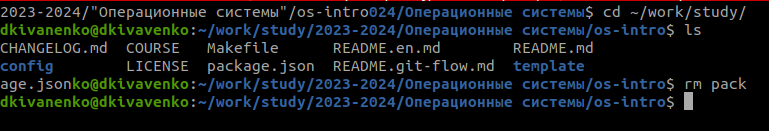

---
## Front matter
title: "Отчет по лабораторной работе №2"
subtitle: "Предмет: Архитектура Операционных Систем"
author: "Иваненко Дмитрий Кириллович"

## Generic otions
lang: ru-RU
toc-title: "Содержание"

## Bibliography
bibliography: bib/cite.bib
csl: pandoc/csl/gost-r-7-0-5-2008-numeric.csl

## Pdf output format
toc: true # Table of contents
toc-depth: 2
lof: true # List of figures
lot: true # List of tables
fontsize: 12pt
linestretch: 1.5
papersize: a4
documentclass: scrreprt
## I18n polyglossia
polyglossia-lang:
  name: russian
  options:
	- spelling=modern
	- babelshorthands=true
polyglossia-otherlangs:
  name: english
## I18n babel
babel-lang: russian
babel-otherlangs: english
## Fonts
mainfont: PT Serif
romanfont: PT Serif
sansfont: PT Sans
monofont: PT Mono
mainfontoptions: Ligatures=TeX
romanfontoptions: Ligatures=TeX
sansfontoptions: Ligatures=TeX,Scale=MatchLowercase
monofontoptions: Scale=MatchLowercase,Scale=0.9
## Biblatex
biblatex: true
biblio-style: "gost-numeric"
biblatexoptions:
  - parentracker=true
  - backend=biber
  - hyperref=auto
  - language=auto
  - autolang=other*
  - citestyle=gost-numeric
## Pandoc-crossref LaTeX customization
figureTitle: "Рис."
tableTitle: "Таблица"
listingTitle: "Листинг"
lofTitle: "Список иллюстраций"
lotTitle: "Список таблиц"
lolTitle: "Листинги"
## Misc options
indent: true
header-includes:
  - \usepackage{indentfirst}
  - \usepackage{float} # keep figures where there are in the text
  - \floatplacement{figure}{H} # keep figures where there are in the text
---

# Цель работы
Изучить идеологию и применение средств контроля версий и освоить умения по работе с git.

# Задание
Установка git
установка gh
Базовая настройка git
создание ssh ключа и pgp
создание репозитория.

# Выполнение лабораторной работы

1) установка git: 

{#fig:001 width=70%}

2) установка gh: 

{#fig:001 width=70%}

3) базовая настройка git:

{#fig:001 width=70%}

4) создаю ключи ssh:

{#fig:001 width=70%}

5) создаю ключи pgp:

{#fig:001 width=70%}

6) У меня гит хаб настроен, в скринкасте показано. 
Вывожу список ключей и копирую отпечаток:

{#fig:001 width=70%}

Далее вывожу и затем копирую ключ в буфер обмена:

{#fig:001 width=70%}

В гитхабе добавил колюч pgp:

{#fig:001 width=70%}

7) Настраиваю автоматические подписи по инструкции:

{#fig:001 width=70%}

8) Настраиваем gh:

{#fig:001 width=70%}

{#fig:001 width=70%}

Все выполнено:

{#fig:001 width=70%}

9) Создаю репозиторий курса на основе.

{#fig:001 width=70%}

{#fig:001 width=70%}

{#fig:001 width=70%}

10) Настройка каталога курса:

{#fig:001 width=70%}

{#fig:001 width=70%}

11) Добавляю файлы на сервер:

{#fig:001 width=70%}

{#fig:001 width=70%}

# Выводы

Изучили методы работы с git. Изучили применение средств контроля версий.

